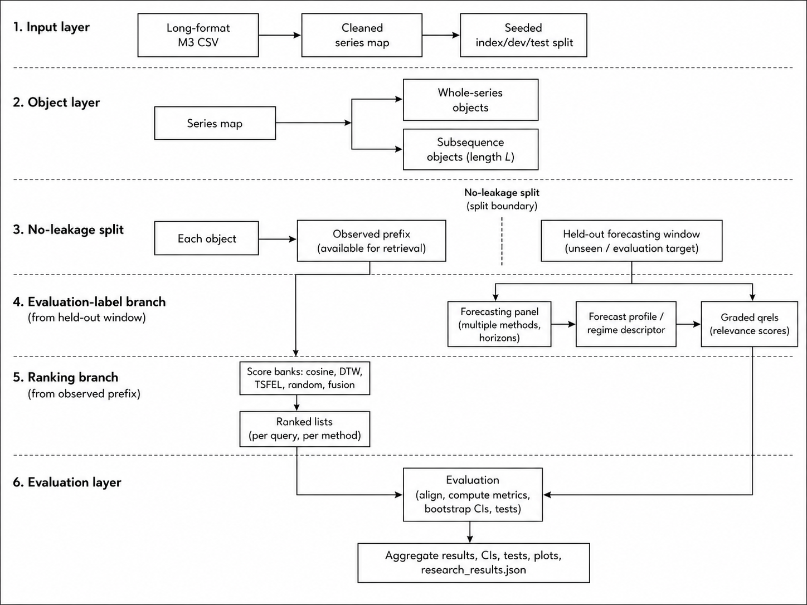

# Forecast-Regime Retrieval Experiments

This repository benchmarks time-series retrieval systems against forecasting-regime relevance labels. The main pipeline turns long-format time series into whole-series and local-pattern retrieval tasks, builds qrels from held-out forecasting behavior, and evaluates retrieval efficacy.



## Setup

Use Python 3.10+ and install the analysis stack:

```bash
python -m venv .venv
source .venv/bin/activate
pip install numpy pandas scikit-learn tsfel statsforecast mlforecast lightgbm xgboost matplotlib ipywidgets ipython
```

For faster checks without the ML forecasting panel, install the same stack except `mlforecast`, `lightgbm`, and `xgboost`, then pass `--skip-ml-models`.

## Main Pipeline

The pipeline follows this path:

1. Load a long-format CSV and keep series with at least eight observations.
2. Split series IDs into `index`, `dev`, and `test` sets.
3. Hold out the late window of each object for evaluation labels.
4. Build forecasting profiles with AutoETS, AutoARIMA, LGBM, and XGB, or only AutoETS and AutoARIMA with `--skip-ml-models`.
5. Convert profiles into forecast-regime qrels using error bins, best model, and model-disagreement bins.
6. Rank indexed objects from pre-holdout histories only.
7. Evaluate whole-series retrieval and pattern retrieval with `p@k`, `ap@k`, and `ndcg@k`.
8. Write CSV tables, JSON reports, diagnostic plots, qrels, and query-level metrics.

Single monthly run:

```bash
python pipeline_research_bins.py \
  --input M3_Monthly_full.csv \
  --output-dir results_ri_bins_paper/monthly \
  --dataset-name M3_monthly \
  --frequency monthly \
  --pattern-len 24 \
  --pattern-lens 12,24,36
```

Multi-frequency run:

```bash
python pipeline_research_bins.py \
  --monthly-input M3_Monthly_full.csv \
  --quarterly-input M3_Quarterly_full.csv \
  --yearly-input M3_Yearly_full.csv \
  --frequencies M,Q,Y \
  --output-dir results_ri_bins_paper \
  --dataset-name M3
```


## Outputs

Each completed run writes `research_results.json` and `splits.json`, plus task and experiment artifacts:

- `task1_*` files describe whole-series retrieval.
- `task2_*` files describe the main pattern retrieval task.
- `task2_L{length}_*` files describe additional pattern-length runs.
- `exp1_pattern_main.csv` compares pattern retrieval systems.
- `exp2_whole_vs_pattern.csv` compares whole-series and pattern retrieval.
- `exp3_retrieval_ablation.csv` compares random ranking and the best content baseline.
- `exp4_pattern_length_sensitivity.csv` reports sensitivity to pattern length.
- `ir_query_metrics_test.csv`, `ir_system_uncertainty.csv`, and `ir_pairwise_random_tests.csv` provide query-level diagnostics and robustness checks.
- `research_results_plots.pdf` and `fig_*.png` contain generated plots when plotting is enabled.

Retrieval systems use only pre-holdout histories. The held-out late window is used only to define evaluation qrels.

## Notebook Retrieval Explorer

After running the pipeline, open a notebook from the repository root and launch the widget UI:

```python
from notebook_retrieval_explorer import launch_explorer

launch_explorer(
    data_csv="M3_Monthly_full.csv",
    results_dir="results_ri_bins_paper/monthly",
    top_k=10,
)
```

The widget lets you choose whole-series or pattern retrieval, pattern length, retrieval system, query ID, and top-k depth. It shows the query, retrieved objects, scores, qrels relevance, forecast regimes, and plots.

You can also use the explorer programmatically:

```python
from notebook_retrieval_explorer import (
    PATTERN_TASK,
    WHOLE_TASK,
    RetrievalNotebookExplorer,
)

explorer = RetrievalNotebookExplorer(
    data_csv="M3_Monthly_full.csv",
    results_dir="results_ri_bins_paper/monthly",
)

query_id = explorer.query_ids(PATTERN_TASK, split="test", pattern_len=24)[0]
result = explorer.rank(
    query_id=query_id,
    task=PATTERN_TASK,
    split="test",
    system="pattern_raw_cosine+pattern_tsfel",
    pattern_len=24,
    top_k=10,
)

result.ranking[["rank", "doc_id", "score", "relevance", "best_model"]]
```

For a whole-series example, switch the task and system:

```python
query_id = explorer.query_ids(WHOLE_TASK, split="test")[0]
result = explorer.rank(
    query_id=query_id,
    task=WHOLE_TASK,
    split="test",
    system="raw_dtw+tsfel",
    top_k=10,
)
```

Export a compact qualitative figure:

```python
from notebook_retrieval_explorer import PATTERN_TASK, export_qualitative_example

export_qualitative_example(
    data_csv="M3_Monthly_full.csv",
    results_dir="results_ri_bins_paper/monthly",
    output_path="figures/qualitative_monthly_series_example.pdf",
    task=PATTERN_TASK,
    pattern_len=24,
    system="pattern_raw_cosine+pattern_tsfel",
    top_k=3,
)
```

## Summaries And Sensitivity

Summarize completed paper runs:

```bash
python summarize_paper_results.py --root results_ri_bins_paper --metric ndcg@10
```

Run a sensitivity grid:

```bash
python pipeline_research_bins_sensitivity.py \
  --input M3_Monthly_full.csv \
  --output-dir results_ri_bins_sensitivity/monthly \
  --dataset-name M3_monthly \
  --forecast-h-grid 3,6,12 \
  --qrels-n-bins-grid 2,3,4 \
  --seeds 1,2,3 \
  --patterns-per-series-grid 1,2 \
  --resume
```
